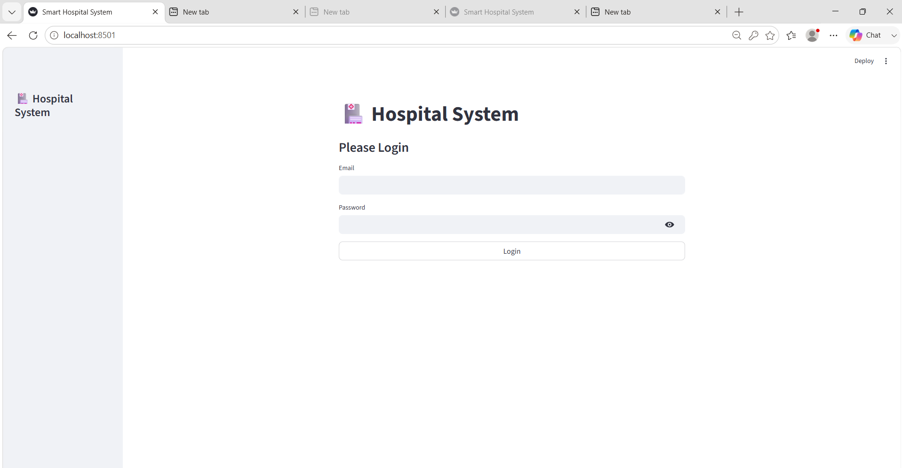
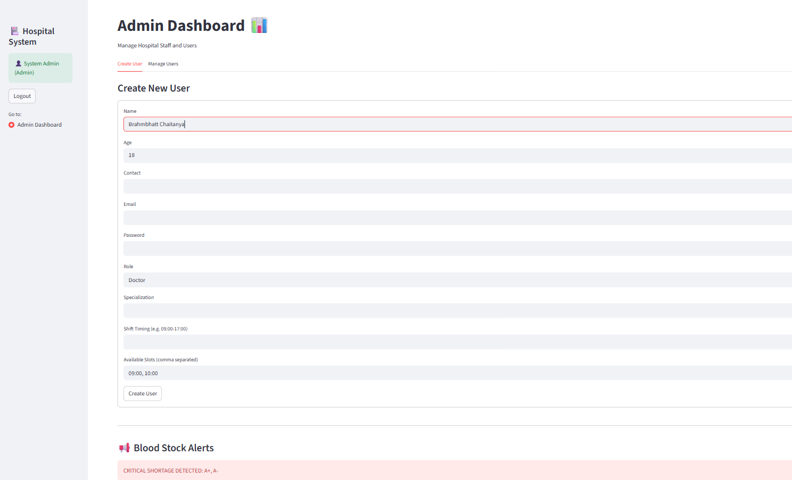
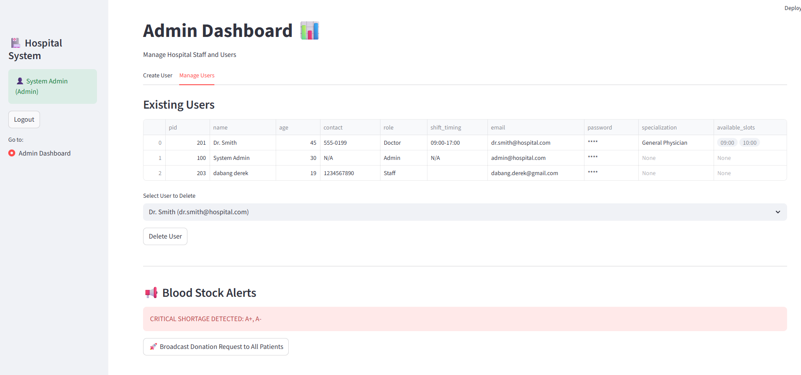
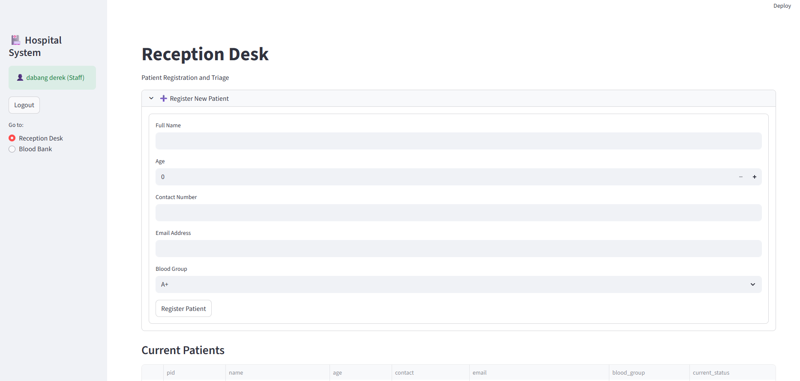
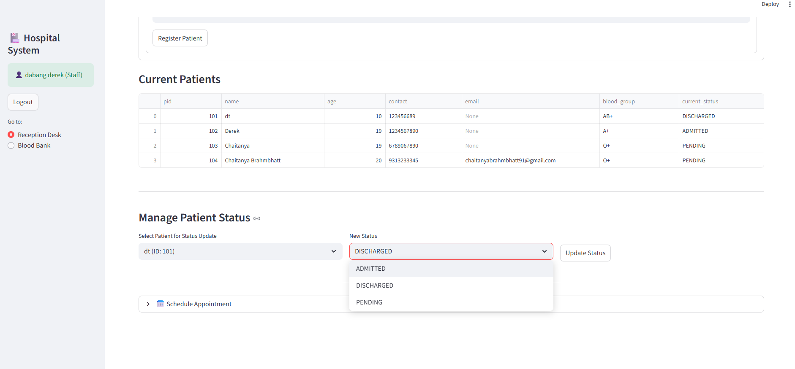
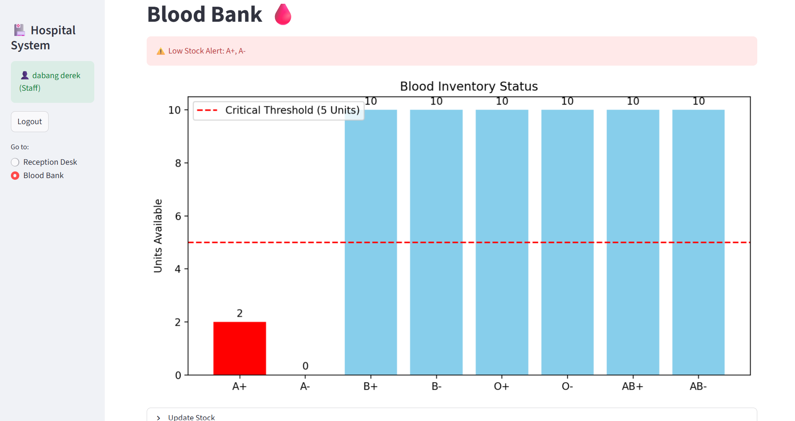
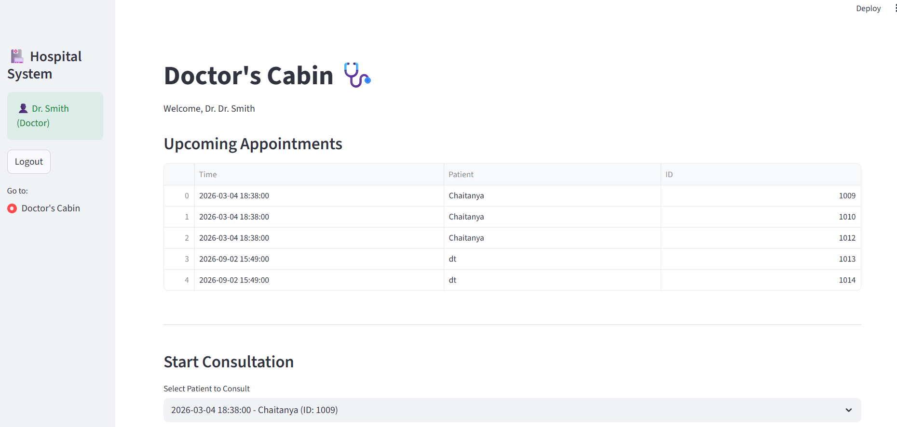
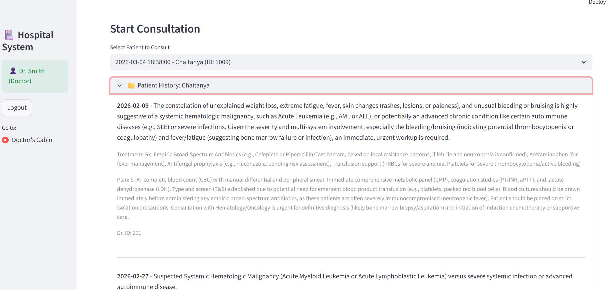
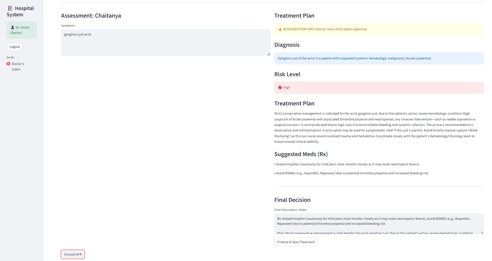

# Smart Hospital Management System 🏥

A comprehensive Python-based Hospital Management System built with Streamlit. This application streamlines hospital operations, including patient registration, doctor appointments, blood bank inventory management, and AI-powered medical consultations.

## Features
-   **Admin Dashboard**: Manage staff, doctors, and system users.
-   **Reception Desk**: Patient registration and status updates.
-   **Doctor's Cabin**: View appointments, access patient history, and use AI for preliminary diagnosis and treatment planning.
-   **Blood Bank**: Monitor blood stock levels with automated alerts for critical shortages.
-   **Medical AI**: Integrated with Google Gemini for symptom analysis and treatment suggestions.

## 🔒 Security Note
This repository is configured to exclude sensitive information:
-   **Environment Variables**: `.env` files containing API keys (e.g., Google Gemini API) are excluded.
-   **Patient Data**: All local JSON data files in the `data/` directory are excluded to protect patient privacy and comply with data security standards.
-   **Configuration**: Streamlit secrets and local configuration files are omitted.

## 🚀 How to Run

### Prerequisites
-   Python 3.8+
-   Streamlit

### Setup
1.  **Clone the repository**:
    ```bash
    git clone <repository-url>
    cd hospital_management_system
    ```

2.  **Create a virtual environment** (recommended):
    ```bash
    python3 -m venv venv
    source venv/bin/activate
    ```

3.  **Install dependencies**:
    ```bash
    pip install -r requirements.txt
    ```
    *(Note: Ensure you include `streamlit`, `pandas`, `numpy`, `google-generativeai`, `python-dotenv` in your requirements)*

4.  **Configure Environment**:
    Create a `.env` file in the root directory and add your Google Gemini API key:
    ```env
    GEMINI_API_KEY=your_api_key_here
    ```

5.  **Run the Application**:
    ```bash
    streamlit run main.py
    ```

6.  **Login**:
    -   Use default credentials (if applicable) or create an Admin user via the interface if the system allows initialization.

---
*Built with ❤️ using Streamlit and Google Gemini.*
=======
# 🏥 Smart Hospital Management System

<p align="center">
  <strong>
    A role-based hospital management application built with Python and Streamlit,
    featuring patient management, appointment scheduling, blood-bank monitoring,
    AI-assisted clinical support, and automated email alerts.
  </strong>
</p>

<p align="center">
  
  
  
  
</p>

---

## 📖 About the Project

**Smart Hospital Management System** is a Python-based hospital management application developed using **Streamlit**.

The system is organized around three main hospital workflows:

- 👨‍💼 **Admin**
- 🧑‍💼 **Staff / Nurse**
- 👨‍⚕️ **Doctor**

Each authenticated user receives access only to the functionality required for their role.

The application combines traditional hospital-management operations with modern technologies such as **Google Gemini AI**, **NumPy-based blood-stock analysis**, **JSON file persistence**, **role-based authentication**, **patient appointment management**, and **SMTP email communication**.

This project was developed as an academic / Proof-of-Concept application to demonstrate Python programming, Object-Oriented Programming, file handling, NumPy, data visualization, Streamlit, external API integration, and modular application design.

---

## ✨ Key Features

- 🔐 Role-Based Login System
- 👨‍💼 Admin Dashboard
- 🧑‍💼 Staff / Reception Desk
- 👨‍⚕️ Doctor's Cabin
- ➕ Patient Registration
- 📋 Patient Status Management
- 📅 Appointment Scheduling
- 📂 Patient Medical History
- 🤖 Google Gemini AI Assistance
- 🛡️ Human-in-the-Loop Treatment Approval
- 🩸 Blood Bank Management
- 📊 Blood Inventory Visualization
- 🚨 Critical Blood Stock Alerts
- 📧 Automated Blood Donation Emails
- 💾 JSON-Based Data Persistence
- 🧠 Multi-Level OOP Architecture
- ✅ Input Validation
- ⚠️ Exception Handling

---

## 🔐 Role-Based Authentication

The application starts with a login screen.

After authentication, the available interface is generated according to the logged-in user's role.

| Role | Main Responsibilities |
|---|---|
| 👨‍💼 Admin | Manage users, monitor blood alerts, broadcast donation requests |
| 🧑‍💼 Staff / Nurse | Register patients, manage status, schedule appointments, manage blood bank |
| 👨‍⚕️ Doctor | View assigned appointments, review history, use AI assistance, finalize treatment |

The application uses **Streamlit Session State** to maintain the active user session while navigating through the system.

---

## 👨‍💼 Admin Dashboard

The Admin Dashboard acts as the management center for hospital staff and system users.

### Admin Capabilities

- Create Doctor accounts
- Create Staff accounts
- Create Nurse accounts
- Create Admin accounts
- Assign email addresses and passwords
- Assign user roles
- Configure shift timing
- Configure Doctor specialization
- Configure Doctor appointment slots
- View existing users
- Delete existing users
- Prevent duplicate email registration
- Monitor critical blood shortages
- Broadcast blood donation requests to registered patients

The credentials created by Admin are later used by Doctors, Staff, and Nurses to access their respective dashboards.

---

## 🧑‍💼 Staff / Reception Desk

The Reception Desk manages patient registration, patient status, appointments, and other operational tasks.

### ➕ Patient Registration

Staff can register a patient using:

- Full Name
- Age
- Contact Number
- Email Address
- Blood Group

Each patient receives a unique Patient ID.

The email field is also used by the blood-donation notification system when the Admin sends an urgent donation request.

### 📋 Current Patients

The system can display patient information including:

- Patient ID
- Name
- Age
- Contact
- Email
- Blood Group
- Current Status

### 🏥 Patient Status Management

Staff can update a patient's status between:

```text
PENDING
ADMITTED
DISCHARGED
```

This allows the application to represent the patient's current stage in the hospital workflow.

---

## 📅 Appointment Management

Staff can connect a registered patient with a Doctor and create an appointment.

### Appointment Flow

```text
Select Patient
      ↓
Select Doctor
      ↓
Choose Date / Time Slot
      ↓
Create Appointment
      ↓
Save Appointment
      ↓
Doctor Receives Assigned Patient
```

An appointment can contain:

```text
Appointment ID
Patient ID
Doctor ID
Patient Name
Doctor Name
Date / Time Slot
Status
```

New appointments begin with:

```text
Scheduled
```

After the Doctor finishes treatment, the appointment is updated to:

```text
Completed
```

---

## 👨‍⚕️ Doctor's Cabin

The Doctor's Cabin provides the main clinical workflow of the application.

Doctors can:

- View their own scheduled appointments
- Select an assigned patient
- Review previous medical history
- Enter current symptoms and observations
- Consult the Gemini AI assistant
- Review AI-generated suggestions
- Edit the final treatment
- Finalize and save treatment
- Complete the appointment

The Doctor dashboard filters appointments using the logged-in Doctor ID so Doctors only see the patients assigned to them.

---

## 📂 Patient Medical History

Before beginning a new consultation, the Doctor can review the selected patient's previous medical records.

A treatment record can contain:

```json
{
  "date": "2026-09-02",
  "diagnosis": "Doctor-confirmed diagnosis",
  "treatment": "Final doctor-approved treatment",
  "doctor_id": "201"
}
```

The patient's medical history is also used as context for the AI assistant so previous clinical information can be considered during a new consultation.

---

## 🤖 Google Gemini AI-Assisted Clinical Support

The project integrates **Google Gemini** as an AI assistant for preliminary clinical support.

The AI receives:

```text
Current Symptoms
      +
Previous Medical History
```

The application uses structured prompting so the AI can return organized JSON-style information such as:

```json
{
  "diagnosis": "Possible diagnosis",
  "treatment_plan": "Suggested treatment plan",
  "suggested_rx": [
    "Suggested medicine"
  ],
  "resources": [
    "Required hospital resource"
  ],
  "risk_level": "Low / Medium / High"
}
```

Structured output allows the application to display the AI response in separate, readable sections.

---

## 🛡️ Human-in-the-Loop AI Safety

The AI does **not** automatically make the final clinical decision.

The application follows this workflow:

```text
Patient Symptoms
        ↓
Patient Medical History
        ↓
Google Gemini
        ↓
AI Suggestion
        ↓
Doctor Review
        ↓
Doctor Edits if Required
        ↓
Finalize Treatment
        ↓
Save to Patient History
```

The AI response is treated only as a suggestion.

The Doctor must review and approve the final treatment before it is stored in the patient's record.

---

## 🔄 Clinical Treatment Loop

When a Doctor completes a consultation:

1. The AI produces a suggested diagnosis and treatment.
2. The Doctor reviews the AI response.
3. The Doctor edits the treatment if required.
4. The Doctor clicks **Finalize & Save Treatment**.
5. A new medical-history record is added to the patient.
6. The patient JSON data is updated.
7. The appointment status changes from `Scheduled` to `Completed`.
8. Streamlit refreshes the interface.
9. The completed appointment is removed from the Doctor's upcoming list.

---

## 🩸 Blood Bank Management

The application contains a dedicated Blood Bank module.

Supported blood groups include:

```text
A+
A-
B+
B-
O+
O-
AB+
AB-
```

Blood stock quantities are processed using **NumPy arrays**.

### NumPy-Based Inventory Logic

The system can use NumPy filtering to identify blood groups whose quantity has fallen below a configured safety threshold.

```text
Blood Stock Data
       ↓
NumPy Threshold Check
       ↓
Low Stock Detection
       ↓
Critical Alert
```

---

## 📊 Blood Inventory Visualization

The Blood Bank provides a visual representation of current blood stock inside the Streamlit application.

The visualization displays:

- Available units for each blood group
- Individual stock quantities
- Critical low-stock blood groups
- A visible critical-threshold line
- Comparison between safe and critical inventory levels

This allows Staff to quickly identify blood groups that require immediate attention.

> The chart is displayed inside the Streamlit application. The README does not claim MATLAB as a project dependency.

---

## 🚨 Critical Blood Stock Alerts

When a blood group falls below the configured safety threshold, the application automatically displays a critical warning.

Example:

```text
LOW STOCK ALERT: A+, A-
```

The Admin Dashboard can also display the shortage and provide an option to broadcast a blood-donation request.

---

## 📧 Automated Blood Donation Email System

When a critical blood shortage is detected, the Admin can click:

```text
Broadcast Donation Request to All Patients
```

The system uses registered patient email addresses to send donation requests.

### Email Flow

```text
Critical Blood Shortage
          ↓
Admin Dashboard
          ↓
Broadcast Donation Request
          ↓
Registered Patient Emails
          ↓
Python smtplib
          ↓
Gmail SMTP
          ↓
Real Email Inbox
```

The donation email can include:

- Patient Name
- Required Blood Group
- Donation Request
- Hospital Location
- Hospital Hours

Email credentials are loaded from environment variables and are not hardcoded inside the Python source code.

---

## 🧠 Object-Oriented Architecture

The project uses standard Python classes and **multi-level inheritance**.

```text
Person
├── Patient
└── Staff
      └── Doctor
```

### 👤 Person

The base class stores common information such as:

- Unique ID
- Name
- Age
- Contact

### 🧑‍🦽 Patient

`Patient` inherits from `Person` and adds:

- Blood Group
- Email
- Medical History
- Current Status
- Assigned Doctor information

### 🧑‍💼 Staff

`Staff` inherits from `Person` and adds:

- Role
- Shift Timing
- Email
- Password

### 👨‍⚕️ Doctor

`Doctor` inherits from `Staff`, creating the multi-level inheritance chain:

```text
Person → Staff → Doctor
```

Doctor-specific information includes:

- Specialization
- Available Appointment Slots

### 🩸 BloodInventory

`BloodInventory` is a standalone class responsible for:

- Blood types
- NumPy stock arrays
- Stock updates
- Low-stock detection
- Inventory data used for visualization

---

## 💾 JSON-Based Data Persistence

The application uses JSON files as its local persistence layer.

Typical data files include:

```text
data/
├── patients.json
├── staff.json
├── appointments.json
└── inventory.json
```

The Data Manager module handles:

- Loading JSON data
- Saving JSON data
- Creating missing data files
- Exception handling
- Maintaining persistence between application restarts

---

## 🔄 Serialization & Deserialization

Python objects cannot be stored directly inside JSON files.

The project therefore converts objects into dictionaries before saving them.

### Serialization

```text
Python Object
      ↓
to_dict()
      ↓
Dictionary
      ↓
JSON File
```

### Deserialization

```text
JSON File
      ↓
Dictionary
      ↓
from_dict()
      ↓
Python Object
```

This allows stored data to be reconstructed into functional Python objects when the application starts again.

---

## ✅ Input Validation

The application includes validation for important user inputs.

### Contact Validation

```text
Exactly 10 digits
```

### Email Validation

Email values are checked before being saved.

Validation helps prevent invalid information from entering the JSON persistence layer.

---

## 🛠️ Technologies Used

| Technology | Purpose |
|---|---|
| Python | Core application development |
| Streamlit | Interactive web interface |
| Google Gemini | AI-assisted clinical suggestions |
| NumPy | Blood inventory calculations and low-stock detection |
| Pandas | Data representation and tables |
| JSON | Local data persistence |
| smtplib | Automated email communication |
| Gmail SMTP | Real email delivery |
| python-dotenv | Environment variable management |
| Streamlit Session State | Authentication and application state |
| OOP | Application architecture |

---

## 📁 Project Structure

```text
hospital_management_system/
│
├── data/
│   ├── patients.json
│   ├── staff.json
│   ├── appointments.json
│   └── inventory.json
│
├── logic/
│   ├── __init__.py
│   └── ai_engine.py
│
├── utils/
│   └── email_service.py
│
├── auth_manager.py
├── data_manager.py
├── models.py
├── main.py
├── requirements.txt
├── .gitignore
└── README.md
```

> Sensitive `.env` configuration is intentionally excluded from the repository.

---

## ⚙️ System Workflow

```text
                         LOGIN
                           │
             ┌─────────────┼─────────────┐
             │             │             │
           ADMIN         STAFF         DOCTOR
             │             │             │
       Manage Users    Register       Assigned
             │          Patients      Appointments
             │             │             │
       Blood Alerts     Patient        Medical
             │          Status         History
             │             │             │
       Donation Email  Appointments    Symptoms
             │             │             │
             │──────── Blood Bank    Gemini AI
                                         │
                                   Doctor Review
                                         │
                                  Final Treatment
                                         │
                                  Patient History
```

---

## 📸 Project Screenshots


Patient registration, patient email/contact data, patient status, and appointment operations.

---
<h2>📸 Project Screenshots</h2>

<h3>🔐 Login Screen</h3>

<p align="center">
  
</p>

<p>
Role-based authentication for Admin, Staff/Nurse, and Doctor users.
</p>

<hr>

<h3>👨‍💼 Admin Dashboard</h3>

<h4>➕ Create User</h4>

<p align="center">
  
</p>

<p>
Create hospital users and assign appropriate roles such as Staff/Nurse or Doctor. The dashboard also provides blood-stock monitoring and emergency donation broadcast functionality.
</p>

<br>

<h4>👥 Manage Users</h4>

<p align="center">
  
</p>

<p>
View and manage registered hospital users, with integrated blood-stock alerts and donation email broadcasting.
</p>

<hr>

<h3>👩‍⚕️ Staff / Reception Desk</h3>

<h4>📝 Register New Patient</h4>

<p align="center">
  
</p>

<p>
Register new patients and maintain essential patient and contact information.
</p>

<br>

<h4>🏥 Manage Patient Status</h4>

<p align="center">
  
</p>

<p>
Monitor current patients and update their hospital status such as Admitted, Pending, or Discharged.
</p>

<br>

<h4>🩸 Blood Bank Management</h4>

<p align="center">
  
</p>

<p>
Monitor blood inventory and update the available stock quantity for individual blood groups such as A+, A−, B+, B−, AB+, AB−, O+, and O−.
</p>

<hr>

<h3>🧑‍⚕️ Doctor's Cabin & Gemini AI</h3>

<h4>📅 Upcoming Appointments</h4>

<p align="center">
  
</p>

<p>
Doctors can view assigned and upcoming patient appointments and begin consultation when required.
</p>

<br>

<h4>📋 Patient History & Consultation</h4>

<p align="center">
  
</p>

<p>
View the selected patient's previous medical history and consultation information before providing treatment.
</p>

<br>

<h4>🤖 Gemini AI Treatment Assistant</h4>

<p align="center">
  
</p>

<p>
Doctors can enter patient symptoms and use Gemini AI to receive intelligent treatment suggestions as clinical assistance before making the final doctor-approved treatment decision.
</p>

<hr>
---

## 🚀 How to Run Locally

### 1. Clone the Repository

```bash
git clone YOUR_REPOSITORY_URL
```

### 2. Navigate to the Project

```bash
cd hospital_management_system
```

### 3. Create a Virtual Environment

#### Windows

```bash
python -m venv venv
```

Activate:

```bash
venv\Scripts\activate
```

#### macOS / Linux

```bash
python3 -m venv venv
source venv/bin/activate
```

### 4. Install Dependencies

```bash
pip install -r requirements.txt
```

### 5. Configure Environment Variables

Create a `.env` file in the project root.

Example:

```env
GEMINI_API_KEY=your_gemini_api_key
EMAIL_ADDRESS=your_sender_email@gmail.com
EMAIL_APP_PASSWORD=your_gmail_app_password
```

> Use a Gmail **App Password**, not your normal Gmail account password.

### 6. Run the Application

```bash
python -m streamlit run main.py
```

The application normally opens at:

```text
http://localhost:8501
```

---

## 🔒 Security Notes

Sensitive configuration must not be committed to GitHub.

Recommended `.gitignore` entries:

```gitignore
.env
__pycache__/
*.pyc
venv/
.streamlit/
```

For this Proof-of-Concept, authentication is implemented locally. A production version should use password hashing, stronger authorization, secure persistent storage, and audit logging.

---

## ⚠️ Medical AI Disclaimer

The AI functionality in this project is intended for **academic and demonstration purposes only**.

Google Gemini provides suggested information only.

The project follows a **Human-in-the-Loop** design where the Doctor must independently review, modify, and approve the final diagnosis or treatment before it is stored.

This system is not intended to replace qualified medical professionals or real clinical systems.

---

## 📚 Concepts Demonstrated

- Python Programming
- Object-Oriented Programming
- Classes and Objects
- Multi-Level Inheritance
- Mutable Data Structures
- File Handling
- JSON Processing
- Serialization
- Deserialization
- Factory Methods
- Exception Handling
- Modules and Packages
- NumPy Arrays
- NumPy Boolean Filtering
- Data Visualization
- Pandas DataFrames
- Streamlit UI
- Streamlit Session State
- Role-Based Access Control
- CRUD Operations
- Authentication
- Input Validation
- Appointment Management
- External API Integration
- Google Gemini
- Prompt Engineering
- Structured JSON AI Output
- Human-in-the-Loop AI
- SMTP
- Gmail Email Delivery
- Environment Variables

---

## 🔮 Future Improvements

- SQL / MongoDB database
- Password hashing
- Cloud-based persistent storage
- Patient login portal
- Online appointment booking
- Prescription PDF generation
- SMS notifications
- OTP authentication
- Audit logs
- Real-time notifications
- Advanced analytics dashboard
- Doctor availability calendar
- Medical report uploads
- Production-grade authorization
- Secure cloud deployment

---

## 🌐 Deployment

Deployment will be added after final testing and documentation are complete.

---

## ⚠️ Project Scope

Smart Hospital Management System is an **academic / Proof-of-Concept application**.

The current version uses JSON files for local persistence.

A real production hospital system would require additional infrastructure such as:

- Secure production database
- Encrypted credentials
- Strong authentication
- Fine-grained authorization
- Audit logging
- Data backups
- Secure cloud infrastructure
- Healthcare privacy and compliance controls

---

## ⭐ Support

If you found this project interesting, consider giving the repository a **⭐ Star**.

---

<p align="center">
  <strong>Built with ❤️ using Python, Streamlit, NumPy & Google Gemini</strong>
</p>

